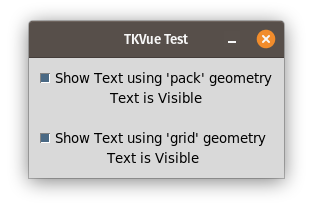

# TKVue Examples

## animated_gif.py

`Label` widget could be used to display animated Gif by using the `image=` attribute

## asyncioloop.py

TKvue uses asyncio event loop. That mean you can make uses of `async` and `await` to asynchronously execute background task while keeping the frontend responsive.

In this example, 3 seconds after opening the application, an HTTP request is executed to check if a newer version is available.

## background.py

Illustrate how to use [`place` geometry manager](https://www.tcl.tk/man/tcl8.2.3/TkCmd/place.html) to create a background image for the window.
It's then possible to create other widgets on top of the background. This solution is very limited because Tcl cannot draw transparent background.

## combobox.png

Give an examples how to use [`ComboBox`](https://www.tcl.tk/man/tcl/TkCmd/ttk_combobox.html#M13) widget with a binding for `values` and `textvariable` to create a bi-directional binding.

## custom-theme.py

As documented in Tk, it's possible to customize the apperences of all the widget using styles. This examples is a very simplified version to demonstrate how to customize the default theme to better reflect your branding.

## disabled_button.py

Tkvue allow you to change the state of some widget. You may read more about this in Tcl documentation. To disable the state of a button dynamically, make uses of `state=`.

## dynamic_geometry.py

If you need to dynamically adjust the size of your window. it's possible to do it using databinding as you would do for other configuration with `geometry=` on the `TopLevel` widget.

## dynamic_loop.py

Using the special `for=` attribute it's possible to create a dynamic list of widgets based on you model. It's possible to use construction like `for="i in range(1, count)"` or `for="i in your_items"` to loop on number or to loop on items in a list making `i` available in the children widgets. Tkvue will take care of creating and deleting the widget dynamically.

## dynamic_visible.py

Using the special `visible=` attribute it's possible to show/hide widget based on you data model.

## image.py

The `Label` widget could be used to display image using the `image=` attribute pointing to an image path. In combination with [`compound=` attribute](https://www.tcl.tk/man/tcl/TkCmd/options.html#M-compound) it's possible to control where the image is displayed relative to the text.

## modal.py

This is an examples how to show a Modal dialog using TKVue component.

## not_resizable.py

With the [`resizable="False False"`](https://wiki.tcl-lang.org/page/wm+resizable), it's possible to make your windows un-resizable by the user.

## progressbar.py

This is an examples to illustrate how to use the [`ProgressBar`](https://anzeljg.github.io/rin2/book2/2405/docs/tkinter/ttk-Progressbar.html) widget and animate it using `asyncio`.

## reusable_component.py

With TKVue it's possible to create component for better reusability. This is an examples of an ErrorComponent used to display an error messages.

## scrollable.py

Whenever you have too many widget to be diplsayed, you will need to use scrollbar. TKVue provide a convenient `ScrolledFrame` widget for this purpose.

## theme.py

Tk provide a default set of theme. Those theme are available in TKvue and it's possible to dynamically switch from one to the other.

## tooltip.py

TKvue provide a convenient widget to create a tooltip for labels, buttons and possibly other widgets. You may also customize the look of the tooltip using styles.

## validation.py

TKVue provide a special `computed` attribute. This could be used to quickly create a validation function for your interface.

